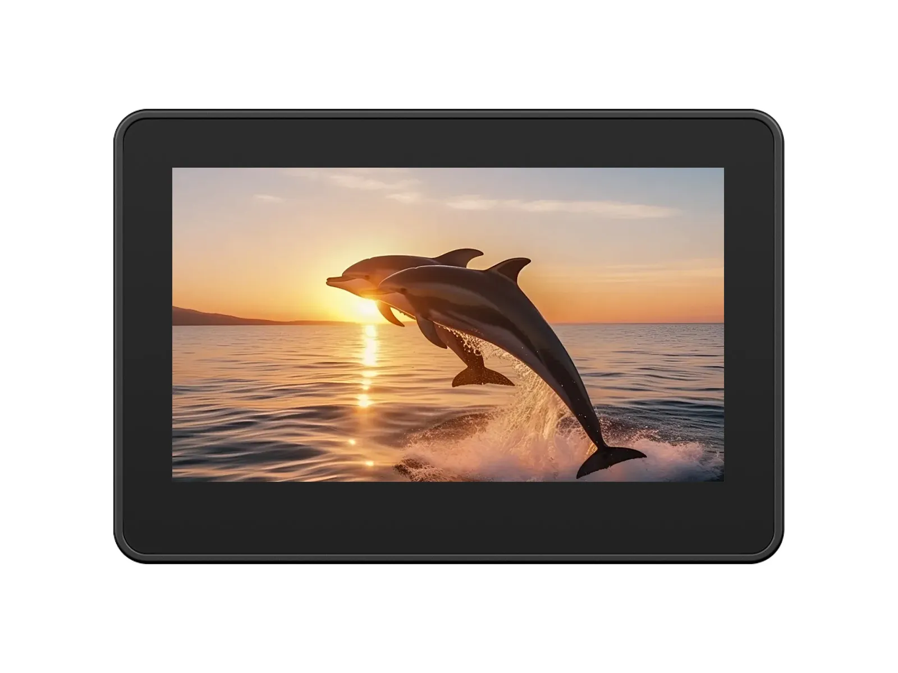

# Waveshare ESP32-S3-Touch-LCD-4.3C

[中文](README_ZH.md)

The ESP32-S3-Touch-LCD-4.3C is a low-cost, high-performance development board built around the ESP32-S3R8 (dual-core Xtensa LX7 @ 240 MHz, 8 MB PSRAM, 16 MB Flash) with 2.4 GHz Wi-Fi and Bluetooth 5 LE. It integrates a 4.3-inch 800 × 480 capacitive touch LCD and an audio module (ES8311 + ES7210), along with an RTC, TF card slot, USB Type-C, isolated digital I/O, and a battery interface, enabling smooth LVGL GUI and AI voice interaction for IoT, mobile devices, and smart home applications.

- [Purchase Link](https://www.waveshare.com/esp32-s3-touch-lcd-4.3c.htm)
- [Documentation](https://docs.waveshare.com/ESP32-S3-Touch-LCD-4.3C)
- [Hardware Reference](HARDWARE_REFERENCE.md)

## Overview

This repository contains first-party ESP-IDF and Arduino examples, factory recovery firmware, SD-card resources, schematics, and mechanical files for the Waveshare ESP32-S3-Touch-LCD-4.3C.

The supported hardware variant uses an ESP32-S3-WROOM-1-N16R8 module with 16 MB flash and 8 MB octal PSRAM. The board combines an 800 x 480 RGB display, GT911 capacitive touch, PCF85063A RTC, ES8311 speaker codec, ES7210 microphone ADC, microSD, Wi-Fi, and Bluetooth LE.

## Getting Started

Choose the framework and open the README in the example directory:

- ESP-IDF projects: [`examples/esp-idf/`](examples/esp-idf/)
- Arduino sketches and bundled libraries: [`examples/arduino/`](examples/arduino/)
- Factory recovery image and SD-card resources: [`firmware/`](firmware/)

ESP-IDF projects use their local `sdkconfig.defaults` files. Arduino builds use the ESP32S3 Dev Module profile with QIO 80 MHz flash, 16 MB flash, OPI PSRAM, the `app3M_fat9M_16MB` partition scheme, USB CDC/JTAG, and 921600 baud upload speed. The exact CI board string is stored in [`config/ci.json`](config/ci.json).

## Examples

| ESP-IDF project | Focus |
| --- | --- |
| `01_i2c` | Shared I2C bus and IO expander |
| `02_rtc` | PCF85063A real-time clock |
| `03_lcd` | RGB LCD bring-up |
| `04_isolation_io` | Isolated digital input/output |
| `05_sd` | microSD over SDMMC |
| `06_touch` | GT911 capacitive touch |
| `07_display_bmp` | Bitmap display from microSD |
| `08_wifi_scan` | Wi-Fi scanning |
| `09_wifi_sta` | Wi-Fi station mode |
| `10_wifi_ap` | Wi-Fi access-point mode |
| `11_speaker_microphone` | ES8311 speaker and ES7210 microphone |
| `12_lvgl_transplant` | LVGL integration |
| `13_lvgl_codec` | LVGL audio player |
| `14_udp_tcp_ntp` | UDP, TCP, and NTP dashboard |

| Arduino sketch | Focus |
| --- | --- |
| `01_i2c` | Shared I2C bus and IO expander |
| `02_rtc` | PCF85063A real-time clock |
| `03_lcd` | RGB LCD bring-up |
| `04_isolation_io` | Isolated digital input/output |
| `05_sd` | microSD access |
| `06_touch` | GT911 capacitive touch |
| `07_display_bmp` | Bitmap display from microSD |
| `08_wifi_scan` | Wi-Fi scanning |
| `09_wifi_sta` | Wi-Fi station mode |
| `10_wifi_ap` | Wi-Fi access-point mode |
| `11_speaker_microphone` | ES8311 speaker and ES7210 microphone |
| `12_lvgl_transplant` | LVGL integration |
| `13_lvgl_btn` | LVGL button interaction |
| `14_lvgl_slider` | LVGL slider interaction |
| `15_udp_tcp_ntp` | UDP, TCP, and NTP dashboard |

First-party sketches live directly under [`examples/arduino/`](examples/arduino/). Examples shipped inside bundled libraries are intentionally excluded from product CI.

## Continuous Integration

The example workflow discovers projects instead of maintaining a hard-coded list. The full matrix contains 28 ESP-IDF builds across the two supported release lines and 15 Arduino builds. Every successful source build is packaged as a flashable archive with a manifest, original binary segments, a combined image, and Windows/POSIX flash helpers.

See [Continuous Integration](docs/ci.md) and [Firmware and Factory Recovery](docs/firmware.md) for dispatch selectors, toolchain pins, artifact contents, and flashing instructions. CI validates compilation and packaging; it does not replace testing on the physical board.

## Repository Layout

| Path | Purpose |
| --- | --- |
| `examples/esp-idf/` | First-party ESP-IDF projects |
| `examples/arduino/` | First-party sketches and bundled Arduino libraries |
| `config/` | CI versions, board options, and factory-image metadata |
| `scripts/` | Example discovery and validation utilities |
| `releases/` | Source-build packaging and artifact download tools |
| `firmware/` | Factory recovery image and runtime SD-card resources |
| `hardware/` | Schematics and mechanical files |
| `docs/` | CI, component, firmware, and repository notes |

See [Repository Structure](docs/repository-structure.md) for ownership and generated-file boundaries.

## Documentation

- [Hardware Reference](HARDWARE_REFERENCE.md)
- [Continuous Integration](docs/ci.md)
- [Components](docs/components.md)
- [Firmware and Factory Recovery](docs/firmware.md)
- [Contributing](CONTRIBUTING.md)
- [Support](SUPPORT.md)
- [Security Policy](SECURITY.md)

## License

This repository is licensed under the Apache License 2.0. See [LICENSE](LICENSE).
